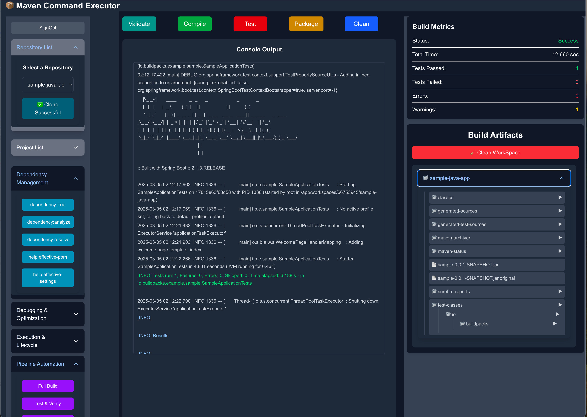

# Maven Executor Demo 🚀

This is a simple demo application that allows users to execute **Maven commands** (`clean`, `compile`, `package`, `test`) via a **Node.js backend** and view real-time logs in a **React frontend**.

## 📌 Features

✅ Run Maven commands directly from the browser  
✅ View real-time logs with color-coded output  
✅ Uses WebSockets for real-time communication  
✅ Full-stack app with **Node.js + React**  

---

## 🌍 Live Demo

[Click here to try the app! 🚀](https://maven-executor-demo.vercel.app/)

---



---

## 🚀 Installation & Setup

### **1️⃣ Clone the Repository**

```sh
git clone https://github.com/gabeodame/maven-executor-demo.git
cd maven-executor-demo
```

---

### 2️⃣ Install Dependencies & Start Application

#### Backend

```sh
cd backend-node
npm install
npm run dev
```

### Frontend

```sh
cd frontend-react
npm install
npm run dev
```


